  ‹ Este perfil foi desenvolvido para o tema escuro do GitHub ›

 

<!-- ========================================== -->
<!-- REPOSITÓRIOS - VAMOS PREENCHER DEPOIS -->
<!-- ========================================== -->

 

<!-- ========================================== -->
<!-- SOBRE MIM -->
<!-- ========================================== -->

 

<!-- ========================================== -->
<!-- TECH STACK -->
<!-- ========================================== -->

 

<!-- ========================================== -->
<!-- FRASE FINAL -->
<!-- ========================================== -->

 

<!-- ========================================== -->
<!-- LINKS -->
<!-- ========================================== -->

&nbsp;&nbsp;

  

© NsyDev

  

